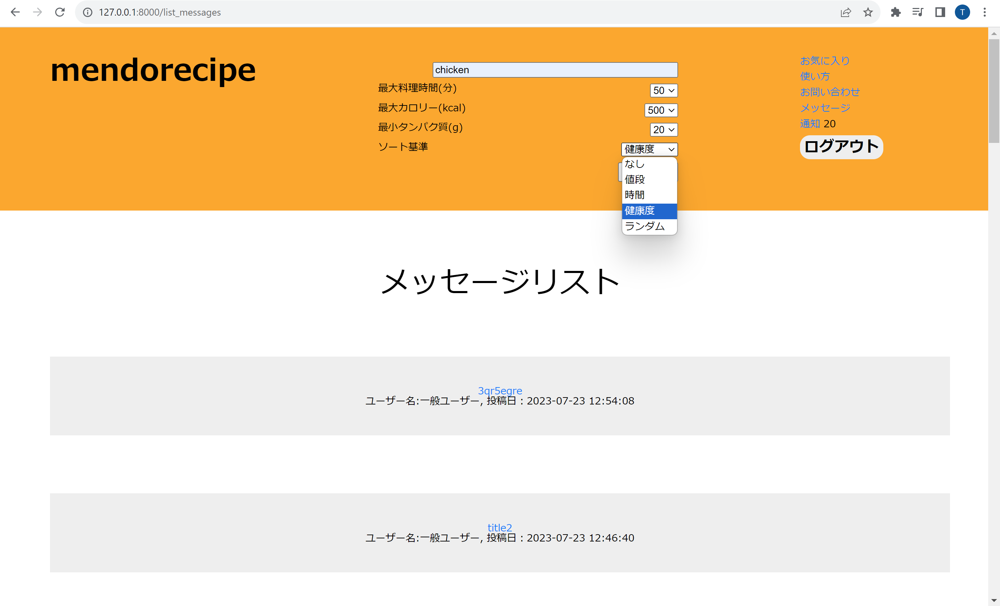
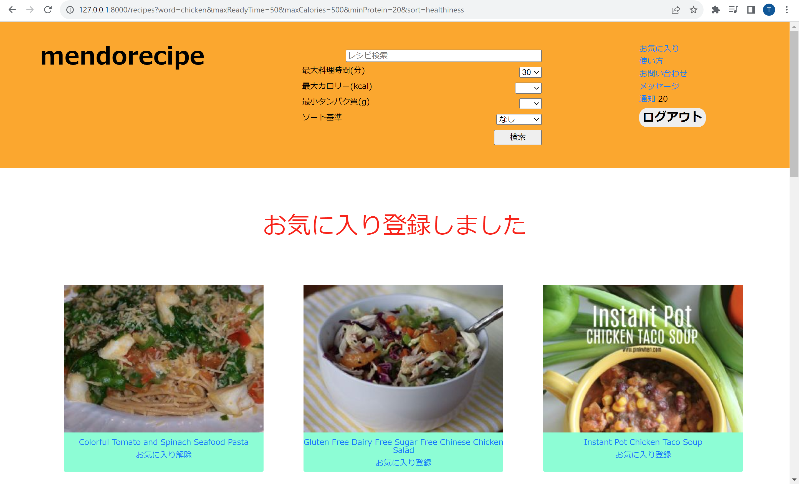
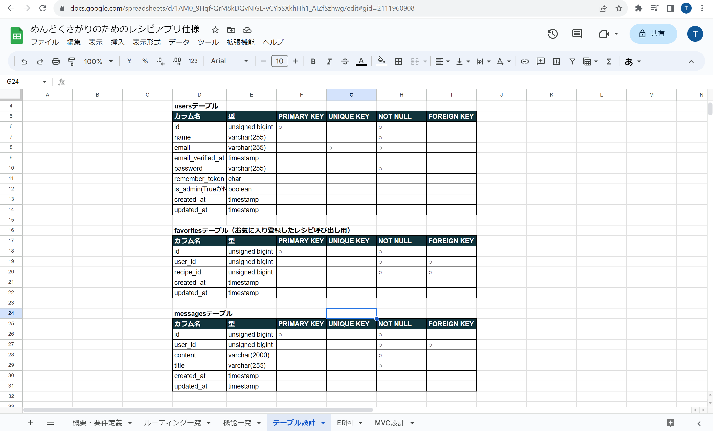
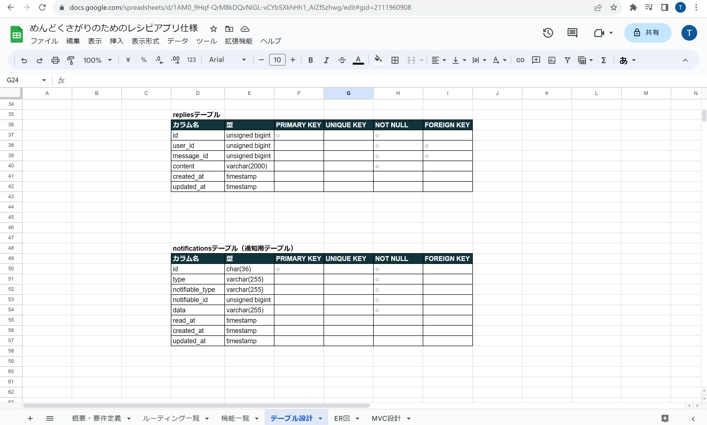
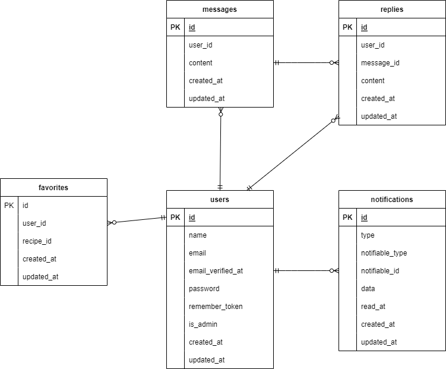

# アプリケーション名：mendorecipe

概要説明

このアプリケーションではSpoonacular APIを利用してレシピの検索、お気に入り登録ができます。検索の条件として、準備時間・最大カロリー・最小タンパク質量があります。並び替えをすることもでき、準備時間・費用・健康度のいずれかを基準にソートできます。ランダムに表示することもできます。

レシピ関連以外ではお問い合わせやお問い合わせメッセージへの返信ができます。ユーザーからのお問い合わせに対してはそのユーザー自身か、管理者のみがアクセス・返信をすることができます。ユーザーがお問い合わせ・返信をすると管理者に、管理者が返信をするとメッセージの投稿者のユーザーにそれぞれ通知が送られます。

以下はレシピ検索のスクリーンショットです。

< --- 検索画像 ---- >

< --- レシピ一覧画像 ---- >

## 作成した目的

概要説明

このアプリは料理が好きでも得意でもないが食事のマンネリ化は防ぎたい、しかし時間がかかりすぎる料理はめんどくさいと感じる、開発者のような人のために作成しました。時間によって検索対象を絞り込むことができるアプリを作るという主目的で作りました。

## 機能一覧

- レシピを検索して表示する（検索ワードはスペースで複数設定可、ページネーションで10件ずつ表示）
- レシピに対してお気に入り登録・お気に入り解除する
- お気に入りレシピの表示　（ページネーションで10件ずつ表示）
- お問い合わせ
- お問い合わせへの返信
- メッセージリストの確認
- 通知の確認

## 使用技術（実行環境）

- php 8.1.6
- Laravel Framework 9.52.10
- MariaDB(xampp) 10.4.24

## テーブル設計

## ER図

